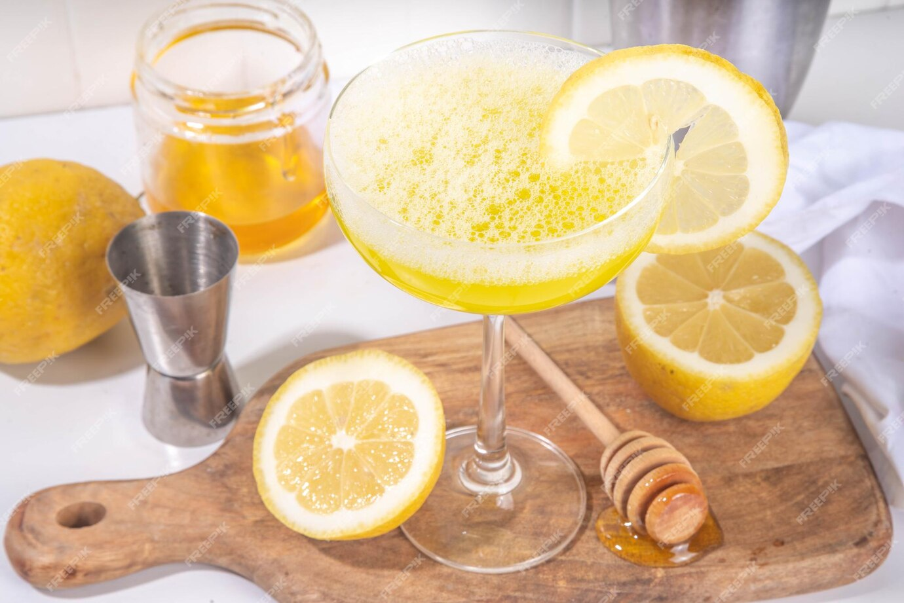

||| :hash: Servings
1
|||

=== Ingredients

- ¾ ounce lemon juice
- ¾ ounce honey syrup
- 2 ounces gin

===

=== Steps

1. Add all ingredients to a shaker tin with ice.
 
 

2. Shake for 15 seconds.
 
 

3. Double strain into a chilled coupe glass.
 
 

4. Garnish with lemon peal.

===
