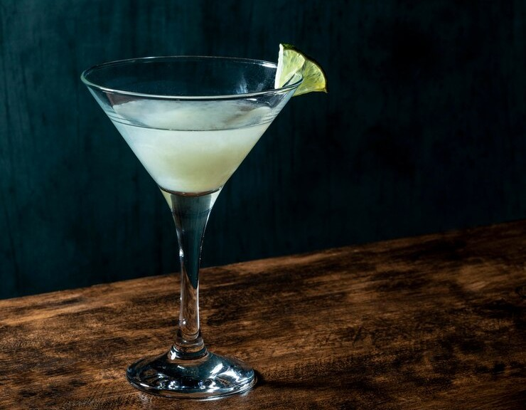

||| :hash: Servings
1
|||

=== Ingredients

- ¾ ounce lime juice
- ¾ ounce simple syrup
- 2 ounces gin
- 2 cucumber slices (optional)
- 2-4 basil leaves (optional)

===

=== Steps

###### Classic

1. Add all ingredients to a shaker tin with ice.
 
 

2. Shake for 15 seconds.
 
 

3. Double strain into a chilled coupe glass.

###### Cucumber Basil Gimlet

1. Add simple syrup along with the cucumber and basil leaves to the shaker tin.
 
 

2. Muddle the ingredients together.
 
 

4. Add the remaining ingredients to a shaker tin with ice.
 
 

5. Shake for 15 seconds.
 
 

6. Double strain into a chilled coupe glass.
 
 

7. Garnish with a cucumber slice on the rim of the glass.

===
