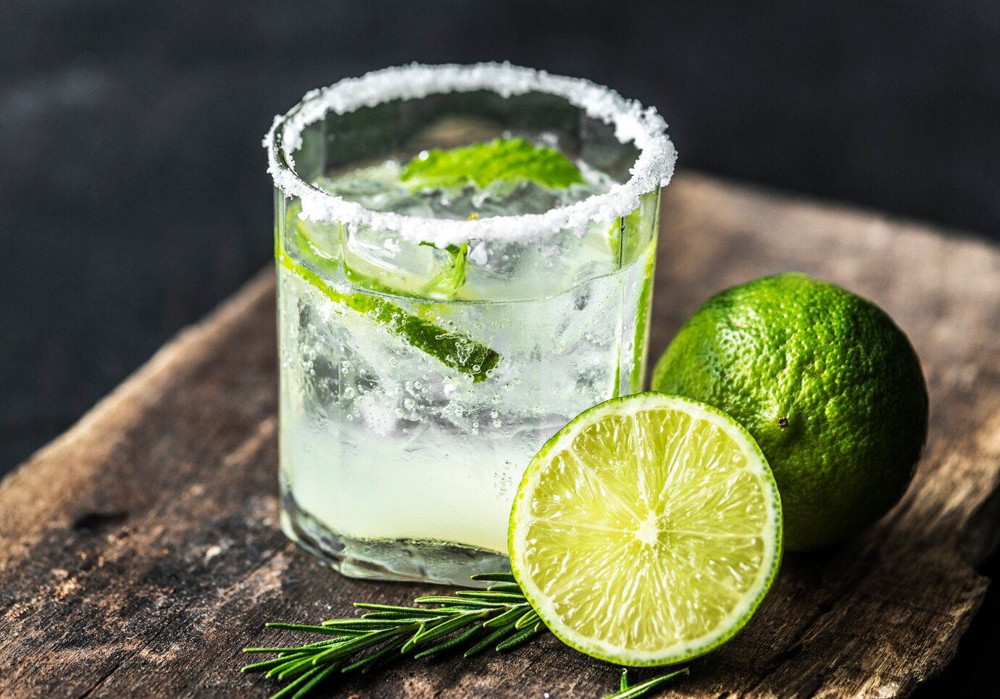

||| :icon-clock: Time
5 mins
||| :hash: Servings
1
|||

=== Ingredients

- 3/4 ounce lime juice
- 3/4 ounce orange liquer (Cointreau, Triple Sec etc)
- 1 1/2 ounces tequila

===

=== Steps

1. Salt the rim of a rocks glass and add some ice
 
 

2. Add all ingredients to a shaker tin with ice.
 
 

2. Shake for 15 seconds.
 
 

3. Double strain into the prepared glass.

===
