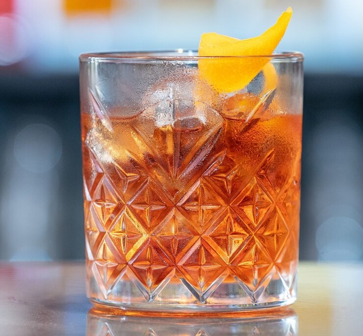

||| :icon-clock: Time
5 mins
||| :hash: Servings
1
|||

=== Ingredients

- 2 ounces burbon 
- 1 tsp simple syrup
- 2 dashes angostura bitters
- orange peel to garnish

===

=== Steps

1. Add a large ice cube or ball to a rocks glass.
 
 

2. Pour the whiskey, syrup, and bitters over the ice and stir well with a bar spoon for 30 seconds.
 
 

3. Spritz the orange peel over the drink, wipe along the rim of the glass and add the peel to the drink.

===
