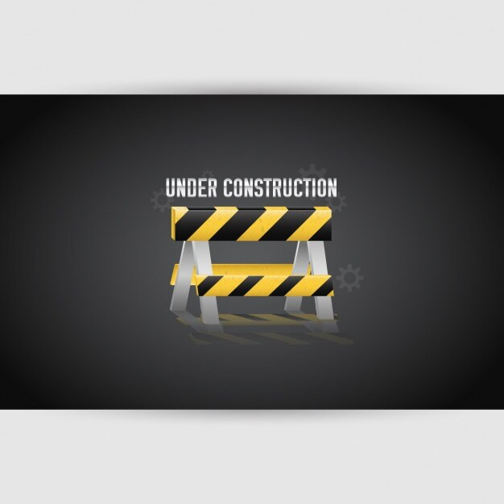

||| :icon-clock: Time
70 mins
||| :knife: Prep
60 mins
||| :cook: Cooking
10 min
||| :hash: Servings
2
|||

==- Ingredients

||| Group1
- Ingredient 1
- Ingredient 2
||| Group2
- Ingredient 1
- Ingredient 2
|||

===

=== Steps

1. Step 1
 
 

2. Step 2
 
 

3. Step 3
 
 

4. ...

===
