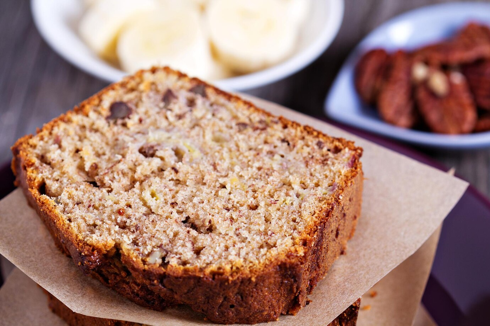

||| :icon-clock: Time
1 hr 10 mins
||| :knife: Preparations
10 mins
||| :cook: Cooking
1 hr
||| :hash: Servings
10
|||

=== Ingredients

- 3 very ripe bananas, (medium/large)
- 115 grams (½ cup) room temperature unsalted butter
- ¾ cup granulated sugar
- 2 large eggs, lightly beaten
- 1 ½ cups all-purpose flour
- 1 tsp baking soda
- ½ tsp salt
- ½ tsp vanilla extract
- ¾ cup chopped walnuts or pistachios 
- ¾ cup chocolate chips

===

=== Steps

1. Preheat the oven to 350°F. Grease and flour a bread loaf pan (9.25 long x 5.25 wide x 2.75 deep).
 
 
2. In a mixing bowl, cream together 8 Tbsp softened butter and 3/4 cup sugar (or honey if using honey).
 
 
3. Mash bananas with a fork until the consistency of chunky applesauce and add them to the batter along with 2 eggs, mixing until blended. 
 
 
4. In a separate bowl, whisk together: 1 1/2 cups of flour, 1 tsp of baking soda and 1/2 tsp of salt then add to batter.
 
 
5. Add 1/2 tsp of vanilla extract and mix in chopped walnuts and raisins. Pour into prepared loaf pan. Bake at 350˚F for 55-60 min or until a toothpick inserted into the center comes out clean. Let banana bread rest for 10 min before transferring to a wire rack to cool.

===
