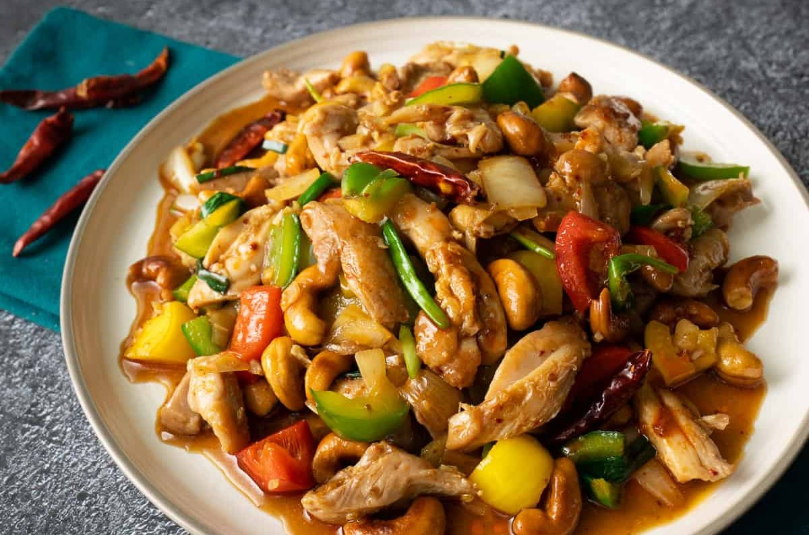

||| :icon-clock: Time
30 mins
||| :knife: Prep
20 mins
||| :cook: Cooking
10 min
||| :hash: Servings
4
|||

=== Ingredients

###### Main Dish
- 400g boneless skinless chicken thighs, sliced
- 2 teaspoons soy sauce
- 2 tablespoons neutral oil
- 7-10 small to medium dried chilies
- 4 cloves garlic, chopped
- ½ onion, 1-inch diced
- ¾ cup green bell pepper, 1-inch diced
- 1 ¼ cups red, orange and/or yellow bell pepper, 1-inch diced
- 1 large carrot, sliced
- ¾ cup unsalted roasted cashews
- 2 green onions, halved lengthwise and cut in 1.5-inch

###### Sauce
- 1 tablespoon oyster sauce
- 1 tablespoon soy sauce
- 1 teaspoon Golden Mountain or Maggi sauce
- 1 teaspoon fish sauce
- 1 ½ teaspoon sugar
- 1 ½ Tablespoons Thai chili paste,
- 1 teaspoon toasted sesame oil

===

=== Steps

1. Combine the chicken thigh with soy sauce and mix well. If using chicken breast, add 1 ½ tablespoon of water in addition to the soy sauce. In either case let it sit for at least 15 minutes.
 
 

2. Combine all sauce ingredients in a small bowl.
 
 

3. If using dried chilies, add the oil to a wok and add the dried chilies; turn the heat on to low. Keep stirring the chilies until they puff and darken into a maroon colour, about 1 minute. Quickly remove them with a mesh skimmer, leaving the oil behind, and place them onto a paper towel lined plate to drain.
 
 

4. In the same wok, turn the heat up to high. Once the oil is very hot, add the chicken and spread the pieces out into one layer as much as you can.
Allow the chicken to sear, undisturbed, for about 2 minutes or until the underside is nicely browned. Once browned, toss the chicken, and keep cooking, stirring frequently, until the chicken is completely cooked. Turn off the heat and remove the chicken from the pan, leaving all the oil behind.
With the heat still off, add the chopped garlic, then turn the heat on to medium. Stir the garlic until the smallest pieces turn golden, then add the onions and stir for about one minute.
 
 

5. Turn the heat up to high then add the bell peppers, the chicken, and the sauce mixture and toss until heated through and well mixed, about 1 minute.
 
 

6. Turn off the heat, then add the green onions and cashews and toss just until mixed. Plate and top with fried chilies, and serve immediately with jasmine rice. 

===
