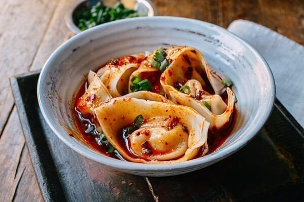

||| :icon-clock: Time
15 mins
||| :knife: Prep
5 mins
||| :cook: Cooking
15 min
||| :hash: Servings
1-2
|||

=== Ingredients

- 8-12 frozen wontons
- 2 tablespoons light soy sauce
- 1 tablespoon chinkiang vinegar
- 3 tablespoons [chili oil](../chili-oil.md)
- Salt (to taste)
- 1 teaspoon toasted sesame paste
- 2 teaspoons sugar
- 2 cloves garlic (finely minced)
- 1-2 stalks green onion for garnish

===

=== Steps

1. Boil the wontons according to package directions
 
 

2. Combine the remaining ingredients in a bowl big enough to serve in and stir to combine
 
 

3. Drain the wontons and add to the bowl along with a bit of the cooking water
 
 

4. Toss the wontons in the sauce and garnish with green onions

===
