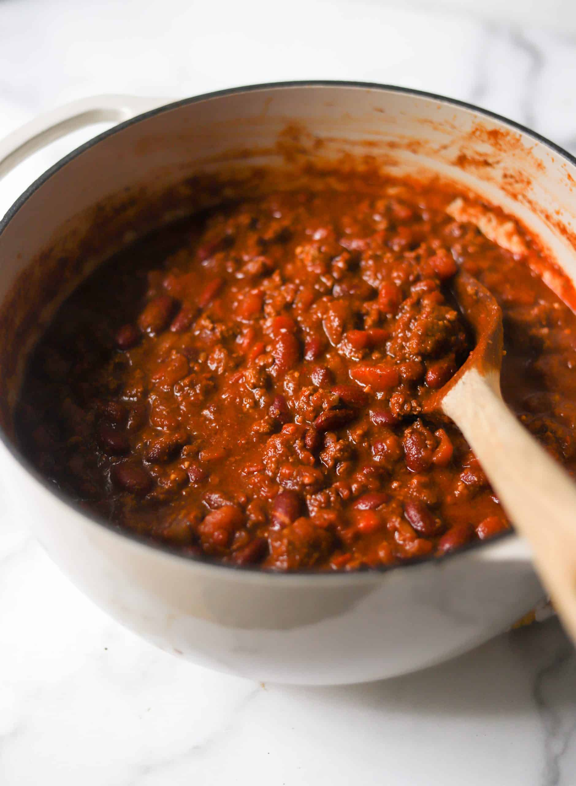

||| :icon-clock: Time
3 hrs
||| :knife: Prep
15 mins
||| :cook: Cooking
2 hr 45 mins
||| :hash: Servings
8
|||

=== Ingredients

###### Chile Paste
- 3 ancho chiles
- 3 guajillo chiles
- 3 pasilla chiles
- 600 ml beef stock

###### Chili Base
- 300g dried pinto or other beans
- 2 lbs ground beef
- 1 red onion chopped
- 1 poblano pepper chopped
- 6-8 garlic cloves diced
- 2g chili flakes
- 20g chili powder
- 20g paprika
- 12g cumin
- 10g cocao powder
- 1 28oz can crushed tomatos
- 1 28oz can diced tomatos (drained)
- 150 ml reserved bean liquid from step 3

###### Seasoning
- 30g brown sugar
- 20g hot sauce
- 20g worcestershire
- 40g apple cider vinegar
- 15g salt

===

=== Steps

1. Soak the beans in 1L water overnight, rinse before proceeding to step 2
 
 

2. Pressure cook the beans and 1L of fresh water on high for 25 minutes, let pressure release slowly. Reserve 150 ml of bean water
 
 

3. Toast the dried chiles on a sheet tray in the oven at 450 degrees for 5-10 minutes. Remove the stems and seeds then blend with the beef stock until a nice even puree is formed
 
 

4. Brown the beef in the bottom of a large (7+ qt) dutch oven, remove from the dutch oven.
 
 

5. Add olive oil, chopped onion and poblano and a pinch of salt. Sautee and deglaze the pan until the veggies soften a bit. Add garlic and cook until the raw smell is gone
 
 

6. Add all the dried spices and let them fry a couple minutes with the veggies. Then add both cans of tomatos, the chile paste from step 3, and the ground beef.
 
 

7. Cook covered in the oven for 90 minutes at 275 degrees
 
 

8. Remove the dutch oven from the oven and add in the cooked beans, reserved bean liquid and all the seasonings, stir then return to the oven at 525 degrees uncovered for 30-45 minutes
 
 

9. Do a final taste test adn adjust seasoning as needed.

===
