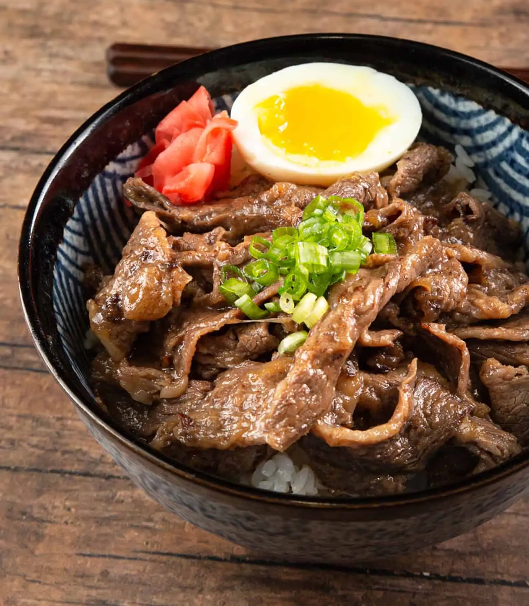

||| :icon-clock: Time
25 mins
||| :knife: Prep
10 mins
||| :cook: Cooking
15
||| :hash: Servings
2
|||

=== Ingredients

- 180 ml [dashi broth](../soups/dashi.md)
- 1 tbsp soy sauce
- 2 tbsp sake
- 2 tbsp mirin
- 1 tbsp sugar
- 1 large onion, slivered
- 340 g thinly shaved beef
- 1 tsp ginger
- sliced scallions for garnish

===

=== Steps

1. Combine dashi, soy sauce, sake, mirin, and sugar in a medium skillet and bring to a simmerover medium heat. Add oinion and simmer until half tender
 
 

2. Add the beef and cook, stirring until the beef is cooked through and the liquid has reduced to a flavoured broth. Stir in the ginger and simmer for one minute longer. Adjust seasoning to taste
 
 

3. Serve over rice, optionally with a poached or soft boiled egg

===
