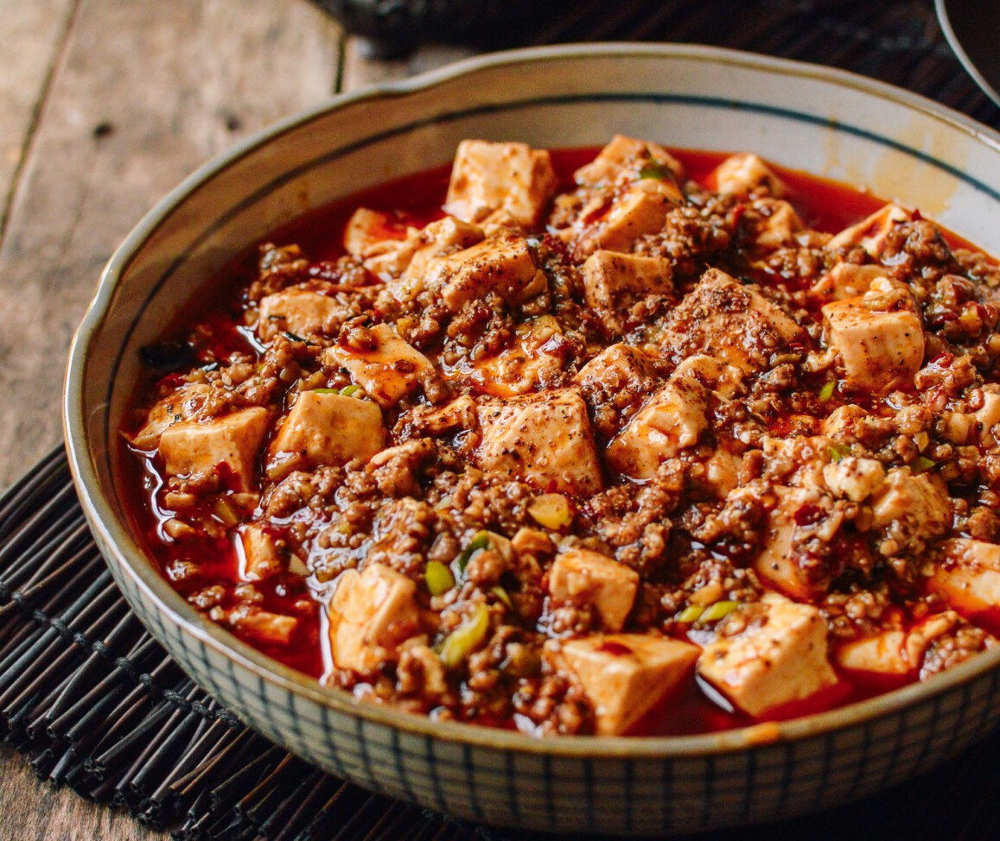

||| :icon-clock: Time
35 mins
||| :knife: Prep
20 mins
||| :cook: Cooking
15 min
||| :hash: Servings
4
|||

=== Ingredients

- 1 package medium firm silken tofu, cut into cubes
- 1-2 tbsp vegetable oil
- 115-230g ground pork
- 3-4 cloves of garlic, minced
- 1 knob of ginger, minced
- 1 tbsp chili bean sauce (doubanjiang)
- 1-2 tbsp pickled sichuan chilis (optional if you like extra spice)
- 1 cup water
- 1 tbsp light soy sauce
- t tbsp shaoxing wine
- ground sichuan peppercorns to taste
- corn starch
- toasted sesame paste
- 1-2 stalks green onion, chopped

===

=== Steps

1. Boil enough water in a pot to fit your tofu and salt the water well. Add the cut up tofu to the water and cook for 3-5 minutes then drain and set aside.
 
 

2. Heat a 3-4 qt pot over medium high heat and toast your sichuan peppercorns unti fragrant. Grind the peppercorns in a mortar and pestle and set aside. Toasting is optional, but worth it and easy to do since you are heating the pot for the next step anyways.
 
 

3. Add the oil and pork to the heated pot and saute.
 
 

4. Once the pork is cooked through add the ginger and garlic and cook for another minute.
 
 

5. Add the chili bean sauce and pickled chilis (if using) and continue cooking over medium heat until the fat from the pork turns red from the chili bean sauce
 
 

6. Add the water, soy sauce, shaoxing wine, and crushed peppercorns then bring the water to a light boil.
 
 

7. Add the drained tofu and cook until the liquid returns to a light boil.
 
 

8. Add a corn starch slurry to the liquid in stages, stirring well until your desired consistency is met.
 
 

9. Remove from heat and add the sesame oil to taste.
 
 

10. Garnish with the chopped green onions and serve with steamed rice.
===
