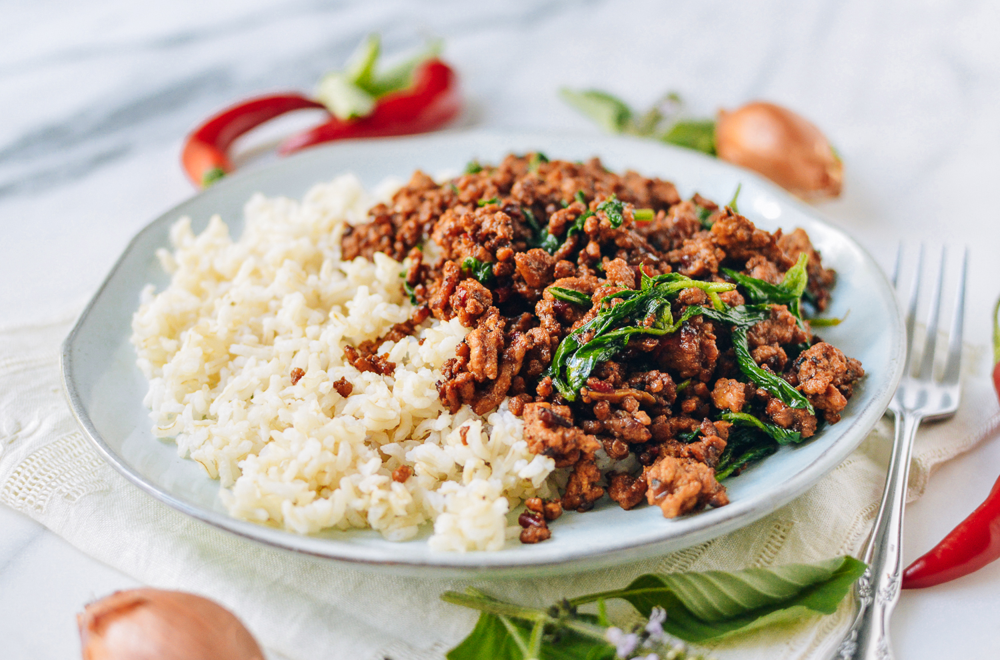

||| :icon-clock: Time
25 mins
||| :knife: Prep
15 mins
||| :cook: Cooking
10 min
||| :hash: Servings
4
|||

=== Ingredients

- 1 lb ground pork
- 2 tbsp vegetable oil
- 1 large shallot, rough chopped
- 6-8 garlic cloves, rough chopped
- 5-10 thai chilis, rough chopped (depending on your spice level)
- 1 tsp sugar
- 1 cup chopped green beens
- 2-4 cups baby spinach
- 1 cup thai basil

###### Sauce
- 1 tbsp dark soy sauce
- 1 tbsp oyster sauce
- 2 tbsp fish sauce
- 1 tsp sugar

===

=== Steps

1. Combine all the sauce ingredients in a bowl and set aside.
 
 

2. Add the shallot, garlic, and chilis to a large mortar and pestle along with the sugar and pound the ingradients until they form a paste.
 
 

3. Heat up a wok over high heat and add the vegetable oil once heated.
 
 

4. Add the paste from step 2 to the pan and saute for a minute or so.
 
 

5. Add the pork and saute until cooked through. Once cooked add the green beans.
 
 

6. Add the sauce and continue cooking until the potency of the sauce odor has subsided a bit
 
 

7. Add the basil and spinach and keep cooking until heated
 
 

8. Serve with steamed rice

===
