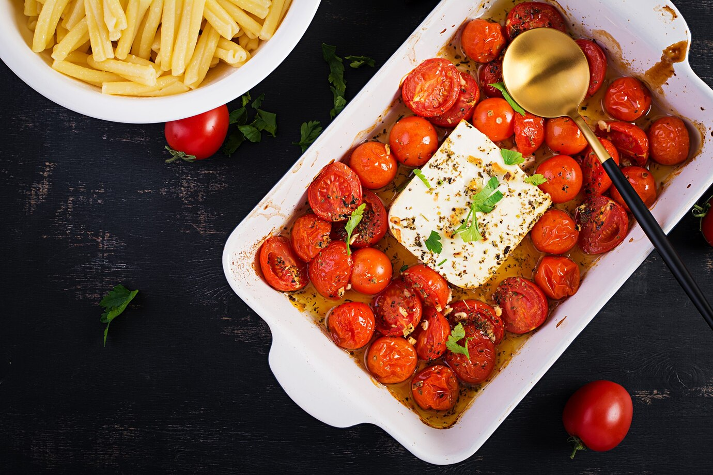

||| :icon-clock: Time
40 mins
||| :knife: Prep
5 mins
||| :cook: Cooking
35 min
||| :hash: Servings
4
|||

=== Ingredients

- 225 grams of pasta
- 4 tablespoons olive oil
- 250 grams block of sheeps milk feta
- 450 cherry tomatoes
- 4 cloves garlic
- 1 small shallot, thinly sliced (optional)
- Crushed red pepper flakes
- fresh cracked black pepper
- 1/4 cup fresh basil leaves, thinly sliced

===

=== Steps

1. Heat oven to 400ºF.  Place one rack in the middle of the oven. Place one rack at the very top, close to the broiler.
 
 
2. Pour 2 tablespoons of the olive oil into an 8 or 9 inch baking dish. Add the tomatoes, garlic, shallots, and chilies. Sprinkle with a pinch of sea salt and pepper to taste. Toss to coat. Add the feta. Drizzle with the remaining 2 tablespoons of olive oil. Crack more pepper over top to taste.
 
 
3. Transfer pan to your oven’s middle rack for 35 minutes. After the 20 minutes, transfer the pan to the top rack, and switch to your oven’s broiler setting. Broil on high for 5 minutes (or more or less), keeping a close watch the entire time. While the tomatoes broil.
 
 
4. Stir the sauce until creamy and add to cooked pasta along with basil. Add reserved pasta water as needed.

===
