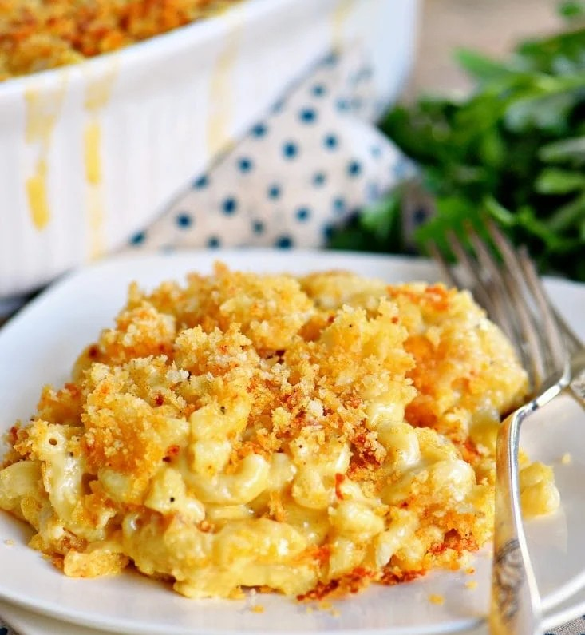

||| :icon-clock: Time
50 mins
||| :knife: Preparations
20 mins
||| :cook: Cooking
30 min
||| :hash: Servings
6
|||

=== Ingredients

- 16 oz elbow macaroni
- 1 tbsp extra virgin olive oil
- 6 tbsp unsalted butter
- 1/3 cup all purpose flour
- 3 cups whole milk
- 1 cup heavy whipping cream
- 4 cups sharp cheddar cheese shredded
- 2 cups Gruyere cheese shredded
- salt and pepper to taste
- 1 1/2 cups panko crumbs
- 4 tbsp butter melted
- 1/2 cup Parmesan cheese shredded
- 1/4 tsp smoked paprika (or regular paprika)

===

=== Steps

1. Preheat oven to 350F. Lightly grease a large 3 qt or 4 qt baking dish and set aside.Combine shredded cheeses in a large bowl and set aside.
 
 

2. Cook the pasta one minute shy of al dente according to the package instructions. Remove from heat, drain, and place in a large bowl.
 
 

3. Drizzle pasta with olive oil and stir to coat pasta. Set aside to cool while preparing cheese sauce.
 
 

4. Melt butter in a deep saucepan, dutch oven, or stock pot.
 
 

5. Whisk in flour over medium heat and continue whisking for about 1 minute until bubbly and golden.
 
 

6. Gradually whisk in the milk and heavy cream until nice and smooth. Continue whisking until you see bubbles on the surface and then continue cooking and whisking for another 2 minutes. Whisk in salt and pepper.
 
 

7. Add two cups of shredded cheese and whisk until smooth. Add another two cups of shredded cheese and continue whisking until creamy and smooth. Sauce should be nice and thick.
 
 

8. Stir in the cooled pasta until combined and pasta is fully coated with the cheese sauce.
 
 

9. Pour half of the mac and cheese into the prepared baking dish. Top with remaining 2 cups of shredded cheese and then the remaining mac and cheese.
 
 

10. In a small bowl, combine panko crumbs, Parmesan cheese, melted butter and paprika. Sprinkle over the top and bake until bubbly and golden brown, about 30 minutes. Serve immediately.

===
