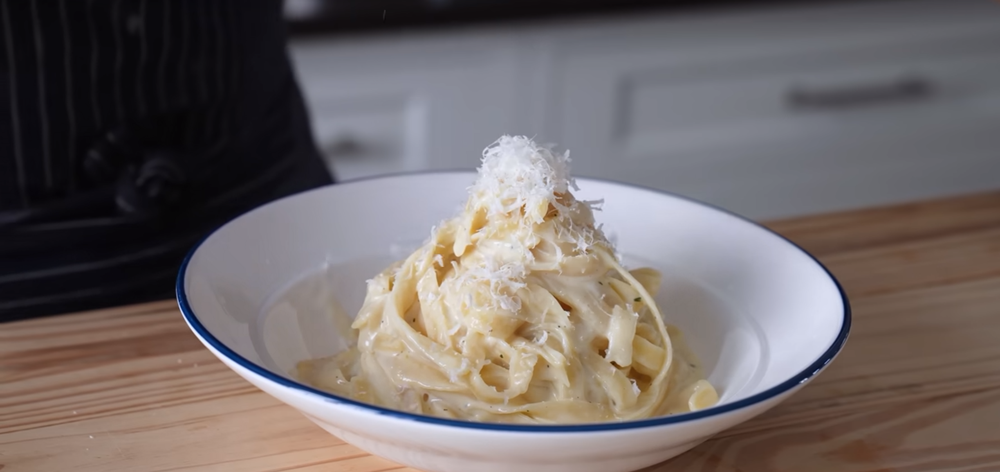

||| :icon-clock: Time
30 mins
||| :knife: Prep
10 mins
||| :cook: Cooking
20 min
||| :hash: Servings
2
|||

=== Ingredients

- 400g Fettuccine
- 115g unsalted butter
- 1 1/4 cup heavy whipping cream
- 5 cloves garlic, finely minced
- 2 tsp finely chopped thyme
- Salt and pepper to taste
- 2 cups parmigiano reggiano
- Black peppercorn 

===

=== Steps

1. Place fettuccine in a pot of boiling water that’s been seasoned generously with salt. Cook according to package instructions or until done. 
 
 

2. In a large pan, add heavy whipping cream and unsalted butter set to medium heat. Constantly stir the pan until all the butter has melted.
 
 

3. Increase the heat slightly and bring to a gentle simmer. Simmer, stirring occasionally, for 3-4 minutes or until lightly thickened.
 
 

4. Cut off the heat and add in parmigiano reggiano, chopped thyme, and finely chopped garlic. Vigorously stir together until thoroughly combined. Season to taste with salt and pepper.
 
 

5. Reserve ¾ cup of pasta water. Drain the pasta.
 
 

6. Add pasta to the alfredo sauce. Toss and using pasta water as needed to fully emulsify. 
 
 

7. Place in a bowl. Top with grated parmigiano reggiano and a crack of black peppercorn before serving. 

===
