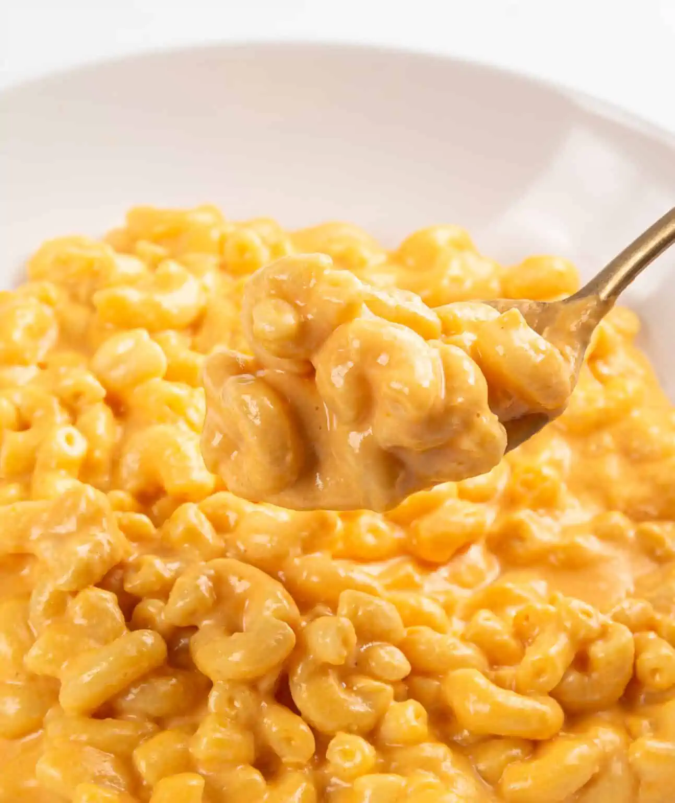

||| :icon-clock: Time
25 mins
||| :knife: Prep
5 mins
||| :cook: Cooking
20 min
||| :hash: Servings
3-4
|||

=== Ingredients

- 227 g elbow macaroni
- 2 tbsp butter
- 2 tbsp all purpose flour
- 420 ml cups milk
- 135 g cheddar cheese, grated
- 4 craft singles slices 
- salt and pepper to taste

===

=== Steps

1. Cook the pasta one minute shy of al dente according to the package instructions. Remove from heat, drain, and return to the pot.
 
 

2. While the pasta is cooking, melt butter in a saucepan.
 
 

5. Whisk in flour over medium heat and continue whisking for about 1 minute until bubbly and golden.
 
 

6. Gradually whisk in the milk until nice and smooth.
 
 

7. Gradually add the grated cheese and kraft singles. Whisk until smooth and add any extra milk as needed for desired consistency
 
 

8. Pour the sauce into the cooked pasta and stir until combined and pasta is fully coated with the cheese sauce.
 
 

===
