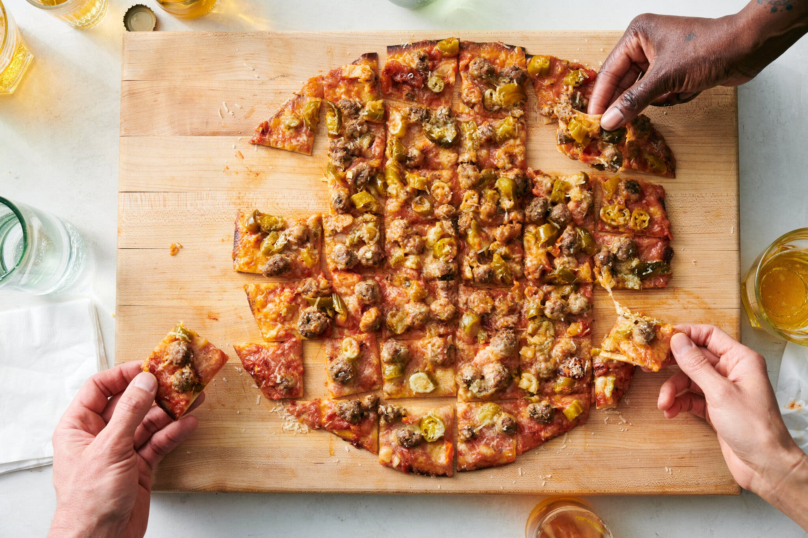

||| :icon-clock: Time
70 mins
||| :knife: Prep
60 mins
||| :cook: Cooking
10 min
||| :hash: Yield
2 14" pizzas
|||

=== Ingredients

- ¾ cup mild or hot giardiniera, drained
- 1 stretched, cured Chicago thin-crust dough skin
- ¾ - 1 cup pizza sauce for Chicago thin-crust
- 2 ounces finely shredded Parmesan
- 225-340 grams full-fat low-moisture mozzarella, shredded
- ½ recipe (~225 grams) Chicago-style Italian sausage
||| Dough
- 300 grams bread flour
- 7 grams sugar 
- 7 grams salt
- 1 gram instant yeast
- 150 gml cold water
- 30grams neutral oil
- Semolina or cornmeal, for dusting
||| Sauce
- 1 796 ml can whole peeled tomatoes with their juices
- 1 153 ml can tomato paste
- 4 medium garlic cloves, minced
- 2 tablespoons extra-virgin olive oil
- 2 tablespoons dried Italian seasoning
- 1 tablespoon granulated sugar
- 2 teaspoons red-wine vinegar
- 2 teaspoons garlic powder
- 1 teaspoon kosher salt
||| Italian Sausage
- 1 tablespoon whole fennel seeds
- 1 pound ground pork
- 4 medium garlic cloves, minced
- 7 grams salt
- 2 teaspoons garlic powder
- 2 teaspoons dried oregano
- 1 teaspoon dried marjoram
- ½ teaspoon ground black pepper
- Large pinch of red-pepper flakes
|||

===

=== Steps

1. At least 45 minutes before baking, set a baking steel or stone (larger than 14 inches) on an oven rack in the lower-middle position and heat the oven to 500 degrees. Drain excess oil from the giardiniera in a fine-mesh strainer, tossing to get as much off as possible. Discard the oil and set aside the giardiniera.
 
 
2. When the oven is heated and you’re ready to bake, dust a pizza peel with semolina or cornmeal. Lift cured pizza skin with the parchment or butcher paper still attached. The top (exposed) side will be drier than the underside. Place the pizza skin on the peel with the drier side facing down (so the papered side faces up). Peel off the parchment paper or butcher paper and discard. Using a fork, poke the crust all over to prevent large bubbles from forming.
 
 
3. Spread the sauce evenly over the entire surface of the pizza, all the way to the edges. Sprinkle with half the Romano or Parmesan. Spread the mozzarella evenly over the entire surface, spreading it all the way to the edges. Use your fingertips to dollop marble-size pieces of the raw sausage all over the pizza. Sprinkle with the giardiniera.
 
 
4. Give the pizza peel a few shakes to make sure the pizza is still loose (if it sticks at all, using a metal spatula or pizza peel to loosen it), then transfer the pizza to the heated baking steel or stone. Bake until the pizza is as done as you like it. (If you like yours browned and bubbly in the center and lightly charred at the edges, that’ll be about 10 minutes, depending on your oven.) You can use a metal pizza peel to lift the edges of the pizza and peek underneath as it bakes to ensure the bottom is done to your liking.
 
 
5. Transfer the pizza to a cutting board and sprinkle immediately with the remaining Romano or Parmesan. Allow to rest for 3 minutes, cut into 1½- to 2-inch squares, and serve immediately. Let the oven reheat for at least 10 minutes before baking subsequent pizzas.
 

_Tips:_ \
This style of pizza works best with minimal toppings–two to three items max. Sausage and giardiniera is a classic combination in the Chicago area. I like using J.P. Graziano hot giardiniera, which is available by mail order.
 

Do not use Italian-style (fresh) mozzarella for this pizza. If you cannot find full-fat low-moisture mozzarella, use a combination of widely available part-skim low-moisture mozzarella and shredded Monterey Jack. The cheeses will melt better if you grate them yourself, but pre-shredded can be used in a pinch.
 

If you do not have a baking stone or steel at least 14 inches square, 12-inch pizzas can also be baked on smaller stones or on the back of a large overturned aluminum sheet tray set on an oven rack while the oven heats. Follow the recipe for 12-inch pizza dough balls as outlined in the Tip for the Chicago thin-crust (tavern-style) pizza dough.
 
 

#### Dough
 

1. **Make the dough:** Combine the flour, sugar, salt and yeast in the bowl of a stand mixer (see Tips). Whisk together to combine, then add the water and oil. Mix at low speed with the dough hook attachment, stopping occasionally to scrape down the sides of the bowl with a rubber spatula, until the dough comes together in a shaggy ball. Cover the bowl and let the dough rest for 10 minutes. Mix on medium-low speed until the dough is silky and pulls away from the sides of the bowl, about 5 minutes. Transfer the dough to a lightly floured work surface.
 
 

2. **Divide the dough:** Using a bench scraper or knife, cut the dough into two even pieces, about 250 grams each. Using lightly floured hands, shape each piece into a smooth ball, then lightly coat each with oil, using your hands to cover every surface. Transfer each ball to a quart-size zipper-lock bag or other sealable container at least three times its volume. (Quart-size plastic deli containers also work for this.)
 
 

3. **Ferment the dough:** For good results, let the dough rest at room temperature until doubled in volume, about 3 hours. For better results, refrigerate the dough overnight. For best results, refrigerate the dough for at least 3 and up to 5 days.
 
 

4. **The day before baking, roll the dough:** Transfer one dough ball to a work surface generously dusted with semolina or cornmeal. (Refrigerated dough can be rolled straight out of the fridge, though allowing it to rest covered for 1 hour at room temperature will make rolling easier.) Using a rolling pin, roll the dough into a very thin circle 14 inches in diameter, lifting and rotating it occasionally (use a ruler or measuring tape to ensure the right size). Repeat with the second ball. If the dough feels like it keeps bouncing back as you try and stretch it, cover it with an inverted bowl or a clean kitchen towel, let it rest for half an hour, then try rolling again.
 
 

5. **Cure the dough:** Transfer the doughs to a flat surface lined with parchment paper or butcher paper. Allow to rest uncovered at room temperature overnight. The top surface of the dough should end up dry to the touch with a leathery feel. If they puff at all during curing, you can push any bubbles with a fork and push them down to flatten 
 

_Tips:_ \
For this recipe, you’ll want an accurate baking scale and enough room to leave your stretched dough out at room temperature for a night. Using a scale to measure your ingredients is strongly advised here — at the very least for the flour. Going without can throw off the hydration level of your dough, and by extension, the success of your dough.
 

If you want to make 2 (12-inch) pizzas instead, use 225 grams flour, 5 grams sugar, 5 grams salt, 1 gram yeast, 115 grams cold water and 22.5 grams oil. Use only ¾ of the toppings.
 

The dough can also be made in a food processor or by hand. To make with a food processor, combine all the ingredients and process until the dough forms a ball that rides around the blades. Continue running the food processor for 30 seconds, then transfer the dough to a lightly floured work surface and continue as directed in Step 2.
 

To make by hand, combine the dry ingredients in a bowl, add the oil and water, and stir with a wooden spoon until a stiff, shaggy dough is formed. Cover the bowl and let the dough rest for 10 minutes. Turn the dough out onto a lightly floured work surface and knead until smooth, 7 to 10 minutes. Proceed as directed in Step 2.
 
 

#### Sauce
 

1. Combine all ingredients in a blender or food processor, and pulse until mostly smooth but a few small bits of tomato remain. Store in a sealed container in the refrigerator for up to 1 week.
 

_Tips:_ \
Dried Italian seasoning is important here, as is garlic powder. If you prefer, you can use a mixture of any or all of oregano, marjoram, thyme, basil, parsley and rosemary, dried or fresh, in place of the Italian seasoning.
 
 

#### Italian Sausage
 

1. Prepare the sausage: Heat the fennel seeds in a dry skillet over medium heat, stirring frequently, until lightly toasted and very aromatic. Transfer to a mortar and pestle or spice grinder and lightly crush.
 
 

2. Combine the pork, fresh garlic, salt, garlic powder, oregano, marjoram, black pepper, pepper flakes, and toasted fennel in a large bowl. Knead aggressively with your hands until the mixture turns tacky and leaves a film behind on the bowl, a couple of minutes. (Alternatively, make the sausage in a stand mixer fitted with a paddle attachment. Knead the mixture at low speed until it forms a film on the inside of the bowl as instructed in Step 2.) Transfer to a sealed container and store in the refrigerator for up to 1 week until ready to use. You will have enough for 2 pizzas.

===
