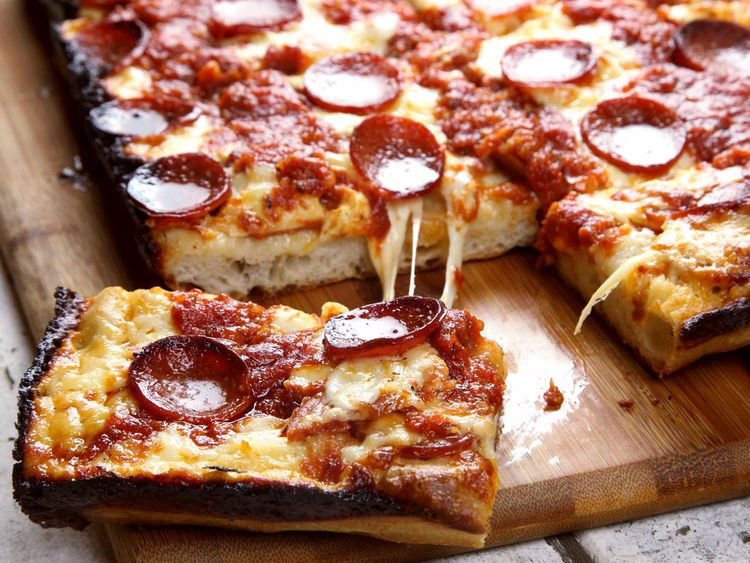

||| :icon-clock: Total Time
4 hrs 10 mins
||| :knife: Prep
40 mins
||| Rising
3 hrs 10 mins
||| :cook: Cooking
60 min
||| :hash: Servings
4
|||

=== Ingredients

###### Dough
- 300 g bread flour (10.5 ounces; about 2 generous cups)
- 5 g instant yeast (0.15 ounce; about 1 teaspoon), such as SAF Instant Yeast
- 9 g salt (0.3 ounce; about 1 1/2 teaspoons table salt or 1 tablespoon Diamond Crystal kosher salt)
- 220 g water (7.75 ounces; about 1 cup minus 1 1/2 teaspoons)
- Extra-virgin olive oil, as needed

###### Sauce
- 2 tablespoons (30 ml) extra-virgin olive oil
- 3 medium cloves garlic, minced
- 2 teaspoons (about 5 g) dried oregano
- Dash red pepper flakes
- 1 (28-ounce; 800 g) can high-quality crushed tomatoes
- 1 teaspoon (about 6 g) granulated garlic powder
- 1 teaspoon (about 6 g) granulated onion powder
- 1 tablespoon (about 15 g) sugar
- Kosher salt, to taste

###### Toppings
- 340 g brick cheese
- 340 g pepperoni

===

=== Steps

1. Combine flour, yeast, and salt in the bowl of a stand mixer fitted with a dough hook attachment. Stir to combine, then add water. Mix on low speed until dough comes together into a rough ball, then shut off mixer and let rest for 10 minutes. Continue mixing at medium-low speed until dough forms a smooth, silky ball, about 10 minutes longer. (It should stick to the bottom of the bowl as it kneads rather than riding around the edges.) Remove dough hook, form dough into a tight ball, set in the bottom of the mixer bowl, cover tightly with plastic wrap, and set aside in a warm place until dough has roughly doubled in volume, about 2 hours. 
 
 

2. Pour a couple tablespoons olive oil in the bottom of a Detroit-style anodized aluminum pan or two 8- by 8-inch cake pans. (Split dough in half if using cake pans.) Transfer dough to pan(s) and turn to coat in oil. Press down on dough and spread it toward the edges. You won't be able to get it all the way to the edges; this is okay. Spread it as much as you can without tearing, then cover tightly in plastic and set aside for 30 minutes to allow dough to relax. Return to dough and stretch it out again. It should be able to reach the edges this time. If not, let it rest a little more and try again. To get the dough to stay in the corners, stretch it up beyond the corners so that it pulls back into place. Once dough is stretched, cover again and set aside while you make the sauce. 
 
 

3. Adjust oven rack to lowest position and preheat oven to 550°F (290°C), or as close to it as your oven gets. Heat 2 tablespoons (30ml) olive oil in a medium saucepan over medium heat until shimmering. Add minced garlic, oregano, and pepper flakes and cook, stirring, until fragrant, about 30 seconds. Add tomatoes, garlic powder, onion powder, and sugar. Bring to a simmer and cook until reduced to about 3 cups, about 30 minutes. Season to taste with salt. 
 
 

4. Press down on dough with your fingertips to remove any large air bubbles. Lay half of pepperoni (if using) evenly over face of dough. Top with cheese, spreading it evenly all the way to the very edges of the pan, then add remaining pepperoni. Spoon sauce over surface in 3 even rows. (You will need only about half the sauce—save the rest for another pizza.) 
 
 

5. Transfer to oven and bake until edges are black and bubbly and exposed cheese on top is starting to lightly brown, 12 to 15 minutes. (If your oven doesn't cook well from the bottom, consider placing the pizza directly on the oven floor.) Transfer to a trivet or folded kitchen towel on countertop. 
 
 

6. Run a thin metal spatula all the way around the edges of the pan to loosen the pizza. Carefully lift it out and slide it onto a cutting board. Cut pizza and serve. 

===
