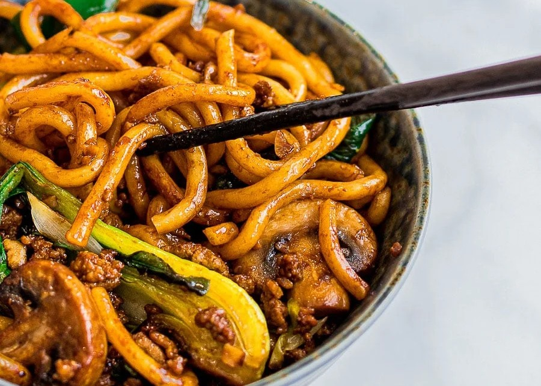

||| :icon-clock: Time
20 mins
||| :knife: Prep
15 mins
||| :cook: Cooking
5 min
||| :hash: Servings
2
|||

=== Ingredients

##### Main Dish
- 400g frozen udon noodles
- 2½ cups stir fry vegetables of your liking
- 2 stalks scallions, cut 2 inches long
- ½ lb ground pork or chicken
- 1 Tablespoon vegetable oil

##### Sauce
- 2½ Tablespoons dark soy sauce - see Note 2
- 2 Tablespoons oyster sauce - see Note 3
- 1 Tablespoon mirin - see Note 4
- 2 teaspoons brown sugar
- ½ teaspoon rice wine vinegar

===

=== Steps

1. Mix all the ingredients for the sauce in a small bowl and set aside.
 
 

2. Cook the Udon Noodles. Remove your udon noodles from its package and add it to a pot of boiling water. Frozen udon noodles can be added directly to the pot of boiling water. Stir gently until your udon noodles are separated and pliable. This should take 1 - 2 minutes. They come precooked so avoid overcooking them as they can get too soft. Rinse and drain your noodles under cold water. If not using right away, drizzle on a little bit of oil to keep them from sticking.
 
 

3. Heat your pan over high heat and add the oil. Add in the ground meat and stir fry until almost cooked. Add the vegetables and stir fry until meat is fully cooked and vegetables are soft. Next add in the noodles, sauce, and scallions. Add less sauce if you prefer. Continue stir frying for about 3 minutes or until well combined. Serve immediately.

===
