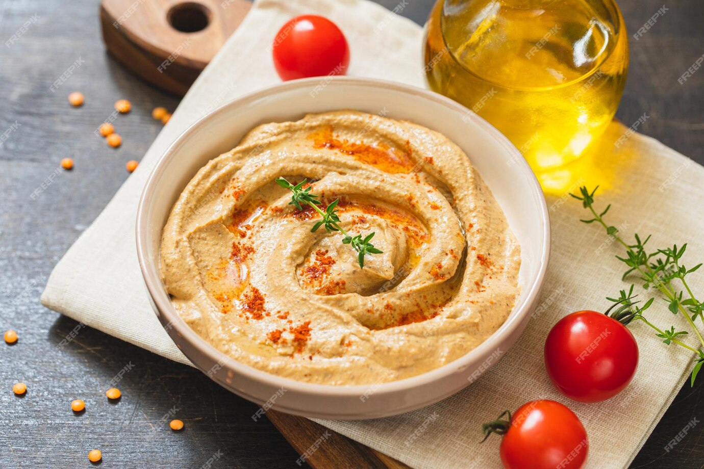

=== Ingredients

- 450g dry garbanzo beans 
- 2Qt/kg water 
- 8g or 1 2/3tsp baking soda 
- 300g or 1 1/3c tahini 
- 20g or 1.5Tbsp salt 
- 60g or 1/4c lemon juice 
- 4-5g or 1tsp citric acid 
- 50g or 1/4c extra virgin olive oil 
- 90-125g ice cubes (5-9 cubes)
- 1 small garlic clove

===

=== Steps

1. Add the beans to a tall container, add 2qt water, stir, and allow to soak overnight. After soaking they should have nearly doubled in size. 
 
 
2. Add soaked beans and water into a pressure cooker along with baking soda. Cook under high pressure for 90 minutes then allow pressure to release for 20 minutes. Beans should be soft but not disintegrated. 
 
 
3. Drain off as much cooking liquid as possible then transfer beans to a food processor along with tahini, salt, lemon juice, and citric acid. Process for 3 minutes then stream in olive oil while still spinning. 
 
 
4. Add ice cubes into food processor one at a time until hummus reaches desired texture/consistency. 
 
 
5. Taste for seasoning and add extra lemon juice, salt, and/or olive oil if needed. 

===
