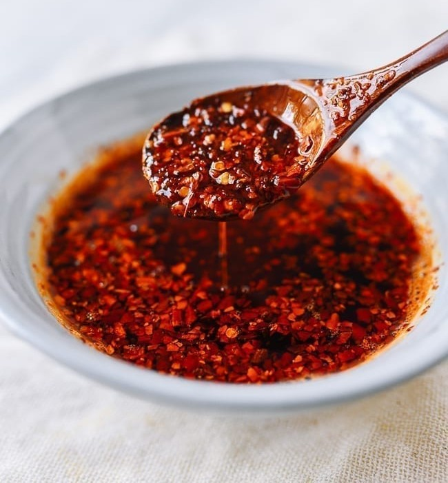

||| :icon-clock: Time
60 mins
||| :knife: Prep
20 mins
|||

=== Ingredients

- 2-3 large shallots
- 15 cloves garlic
- 100 g ginger sliced
- 700 g neutral oil
- 1 cinnamon stick
- 5 pods start anise
- 3 tbsp sichuan peppercorns
- 2 bay leaves
- 2 black cardamon pods
- 2 tsp cloves
- 2 tsp sesame seeds
- 1 1/4 cup chili flakes
- 2 tsp kosher salt
- 1/4 tsp msg

===

=== Steps

1. USe a mandoline to slice the garlic and scallions thin and evenly. Even slicing will ensure they cook evenly and don't burn when frying.
 
 

2. Heat the oil in a pot to 300-350 degrees F, once heated add the garlic chips and fry until lightly browned. The garlic will continue to cook and darken after frying so don't let them get too dark in the oil. Once fried to the desired level, remove the garlic and store on a tray lined with paper towel.
 
 

3. Repeat step 2 for the shallots, they can be fried darker than the garlic as they don't get bitter when over cooked.
 
 

4. Add the sesamle oil and stir.
 
 

5. Season with salt adjusting as necessary to taste.

===
