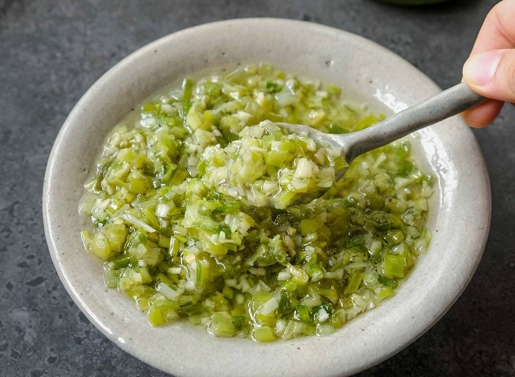

||| :icon-clock: Time
10 mins
||| :knife: Prep
5 mins
|||

=== Ingredients

- 60 g green onion
- 40 g ginger
- 5 tbsp neutral oil
- 1 tbsp  sesame oil
- 2 tsp  salt

===

=== Steps

1. Mince the ginger and scallion for your desired consistency. Place in a heat proof bowl.
 
 

2. Heat the oil to about 350-400F.
 
 

3. pour the heated oil over the ginger and scallions and stir to combine.
 
 

4. Add the sesamle oil and stir.
 
 

5. Season with salt adjusting as necessary to taste.

===
