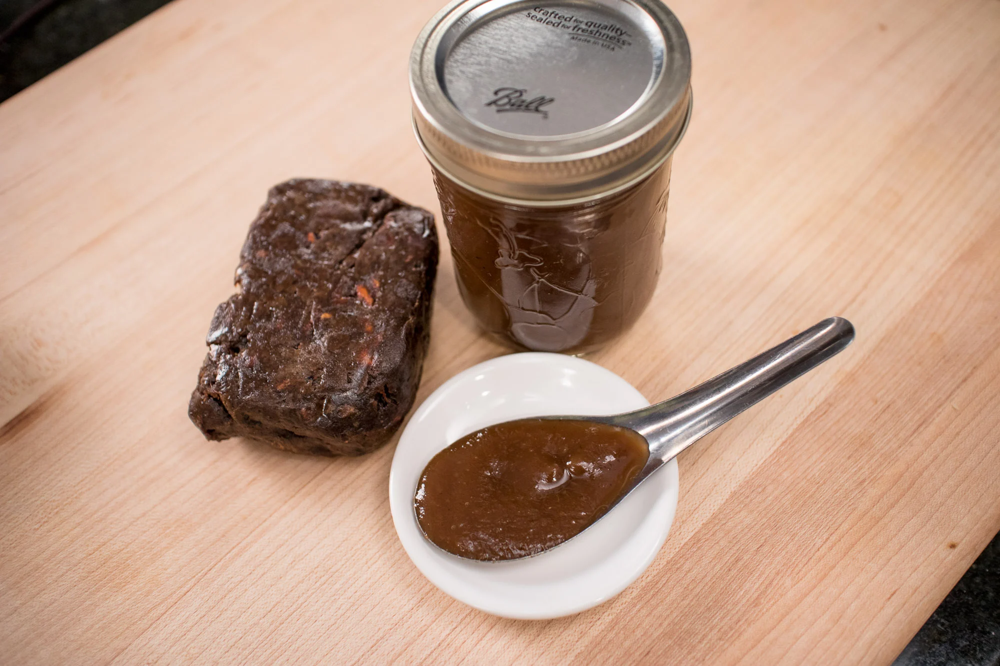

||| :icon-clock: Time
25 mins
||| :knife: Prep
5 mins
||| :cook: Cooking
20 min
||| 

Used for [Pad Thai](../../mains/pad-thai.md)

=== Ingredients

- ½ lb seedless tamarind pulp
- 2 cups hot water
- ½ cup room temp water

===

=== Steps

1. Use your hands to pull apart the tamarind block into small chunks and place it in a large, heat-proof mixing bowl. Pour the hot water over the tamarind and let it sit until it’s cool enough for you to handle, about 20 minutes, though you can let it sit for as long as you need at this point—the longer it sits, the easier the next step will be.\
½ lb seedless tamarind pulp, 2 cups hot water
 
 

2. Use clean hands, preferably gloved, to squeeze and scrunch the pulp to loosen it from the fibers. You should end up with something that has a consistency of a smoothie. A little thinner than smoothie is fine, but too thick will make it hard to strain, so if it looks super thick add a little water.
 
 

3. Once you can feel that most of the pulp has been released from the fibers, strain the tamarind mixture, into a pot through a sieve, preferably not fine-mesh as the paste will be thick and it'll hard to push through. Push as much of the liquid through as possible, and scrape the bottom of the sieve occasionally.
 
 

Tip: If at any point in the process you're having a hard time because the liquid is too thick, do not be afraid to add more water. Some brands of tamarind pulp are more "pulpy" than others and require more water to loosen.
 
 

4. Gradually pour about ½ cup of room temperature water over the remaining fibers in the sieve while using your hand to mix it around. This will rinse off any last little bit of tamarind still stuck in the fibers.
 
 

5. You can use this right away for cooking, but for storage, cook the tamarind paste over medium high-heat until it boils, stirring constantly, as it is quite thick and can bubble and jump at you if you don’t stir. Allow it to bubble for 4-5 minutes to ensure that it is thoroughly heated through before turning off the heat.
 
 

6. Transfer the hot tamarind paste to clean, small mason jars, no larger than 1 cup capacity. I like using the smaller ones so each jar will not be open for as long. Close the lids while still hot and and allow it to cool at room temperature before moving them to the fridge for storage. As it cools the lids will be sucked in and it will seal very well, like jam, but since this was not properly canned, you still need to store them in the fridge. 

===
