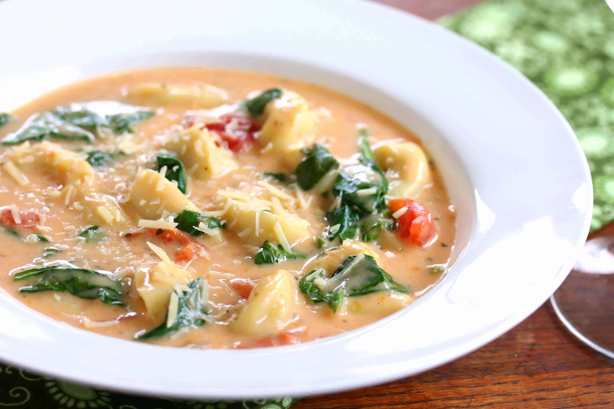

||| :icon-clock: Time
70 mins
||| :knife: Prep
60 mins
||| :cook: Cooking
10 min
||| :hash: Servings
6
|||

=== Ingredients

- 1 medium yellow onion, diced
- 1/3 cup all purpose flour
- 1 Tbsp dried basil
- 2 cloves of garlic, minced
- 2 Tbsp tomato paste
- 3 Tbsp olive oil
- 4 cups chicken broth
- 2 (14.5 oz) cans petite diced tomatoes
- 1 to 1 1/2 lbs boneless, skinless chicken thighs
- 4 cups frozen cheese tortellini (or you can use fresh)
- 3 cups packed spinach (you can definitely add more than this if you want)
- 1/2 cup Parmesan cheese
- 1 cup heavy cream or 1 cup half and half
- Salt and pepper to taste

===

=== Steps

1. Preheat your pot to medium high heat.
 
 

2. Add neutral oil to the pot and sear the chicken thighs, they don't need to be fully cooked here. Remove, chop into pieces, and set aside.
 
 

3. Add the olive oil and diced onions, sautee until onions are translucent then add the garlic.
 
 

4. Add the flour and tomato paste and cook until it becomes a rusty red colour.
 
 

5. Add the chicken broth, diced tomatos, and dried basil.
 
 

6. Bring the soup to a boil then add the tortellini, chopped chicken thighs. Simmer until the tortellini and chicken are cooked.
 
 

7. Add the spinach, parmesan, and heavy cream. Season with salt and pepper and enjoy!

===
