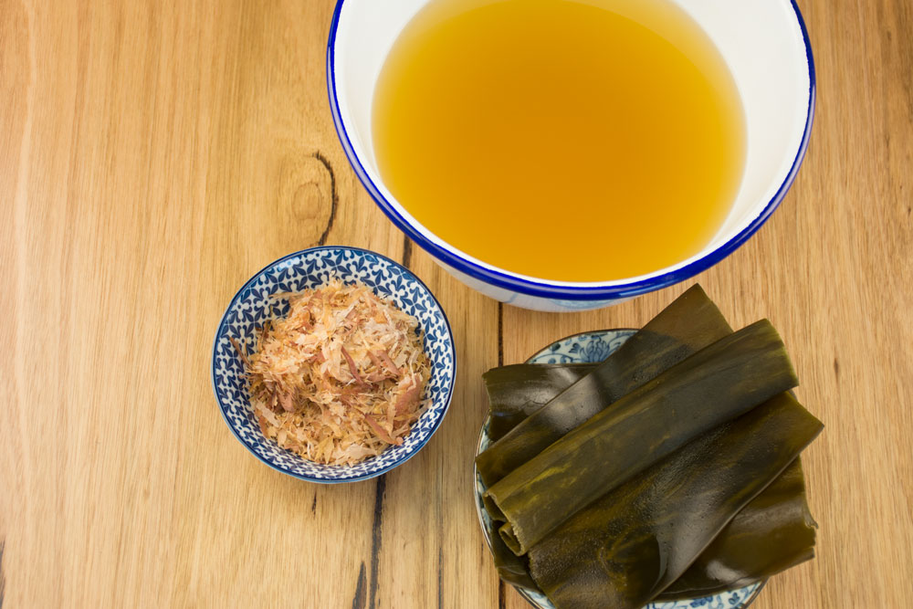

||| :icon-clock: Time
25 mins
||| :knife: Prep
10 mins
||| :cook: Cooking
15
||| :hash: Servings
2
|||

=== Ingredients

- 1.5 L water
- 15 g Kombu
- 20-25 g shaved bonito

===

=== Steps

1. Combine water and kombu in saucepan. Cover and let steep at room temperature for several hours or up to overnight.
 
 

2. Bring to a bare simmer over medium-high heat, keeping an eye on it and adjusting the heat so that it never gets above a bare simmer. Simmer gently for 5 minutes then remove from the heat. Add the bonito flakes and steep for 5 minutes then strain through a fine mesh strainer.

===
