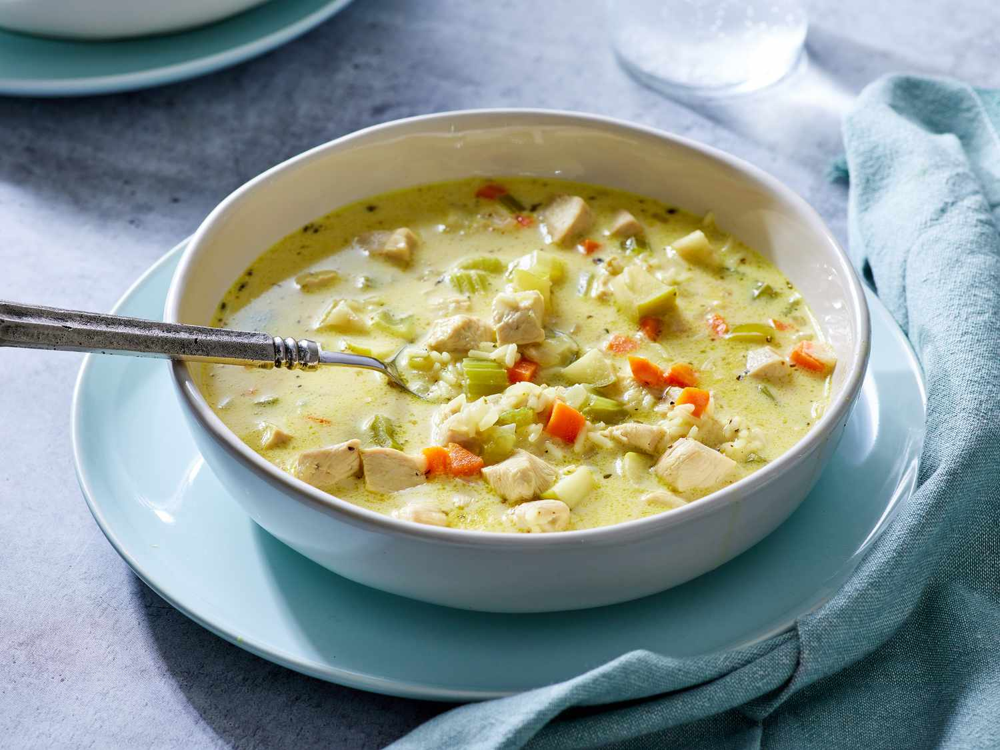

||| :icon-clock: Prep Time
20 mins
||| :knife: Cook Time
1 hr
||| :cook: Total
1 hr 20 mins
||| :hash: Servings
6
|||

=== Ingredients

- Medium onion, diced
- 2 celary stalks, diced
- 1 large carrot, diced
- 60 grams butter
- 1 ½  tablespoon all-purpose flour
- 1 ½ tablespoons all-purpose flour
- 1 ½ teaspoons curry powder
- 4 cups chicken broth
- ½ apple, cored and chopped
- ¼ cup white rice
- 1 skinless, boneless chicken breast half - cut into cubes
- 1 pinch dried thyme
- salt and ground black pepper to taste
- ½ cup heavy cream, heated

===

=== Steps

1. Melt butter in a large soup pot over medium heat. Add onions, celery, and carrot and sauté until soft, 5 to 7 minutes. Add flour and curry, and cook 5 more minutes, stirring frequently. 
 
 
2. Add chicken broth, mix well, and bring to a boil. Reduce heat and simmer for about 30 minutes. Add apple, rice, chicken, thyme, salt, and pepper. Simmer until rice is tender, 15 to 20 minutes.
 
 
3. Just before serving, stir in hot cream. 
 
 
4. Serve and enjoy!

===
