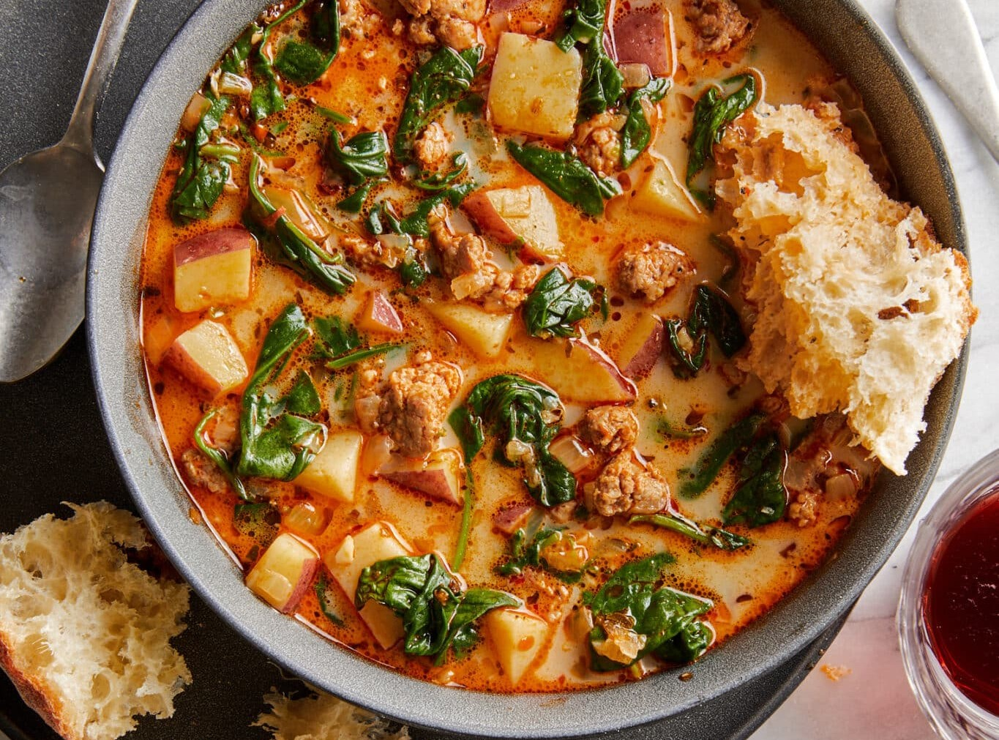

||| :icon-clock: Time
30 mins
||| :knife: Prep
10 mins
||| :cook: Cooking
20 min
||| :hash: Servings
2
|||

=== Ingredients

- 1 tbsp olive oil
- 1 pound spicy Italian sausage, casing removed
- 3 cloves garlic, minced
- 1 onion, diced
- ½ teaspoon dried oregano
- ½ teaspoon dried basil
- ½ teaspoon crushed red pepper flakes (optional)
- Kosher salt and freshly ground black pepper, to taste
- 5 cups chicken broth
- 1 bay leaf
- 1 pound red potatoes, diced
- 3 cups baby spinach
- ¼ cup heavy cream

===

=== Steps

1. Heat olive oil in a large stockpot or Dutch oven over medium heat. Add Italian sausage and cook until browned, about 3-5 minutes, making sure to crumble the sausage as it cooks; drain excess fat.
 
 

2. Stir in garlic, onion, oregano, basil and red pepper flakes. Cook, stirring frequently, until onions have become translucent, about 2-3 minutes; season with salt and pepper, to taste.
 
 

3. Stir in chicken broth and bay leaf, and bring to a boil. Add potatoes and cook until tender, about 10 minutes.
 
 

4. Stir in spinach until it begins to wilt, about 1-2 minutes. Stir in heavy cream until heated through, about 1 minute; season with salt and pepper, to taste.
 
 

5. Serve immediately.
 
 

===
