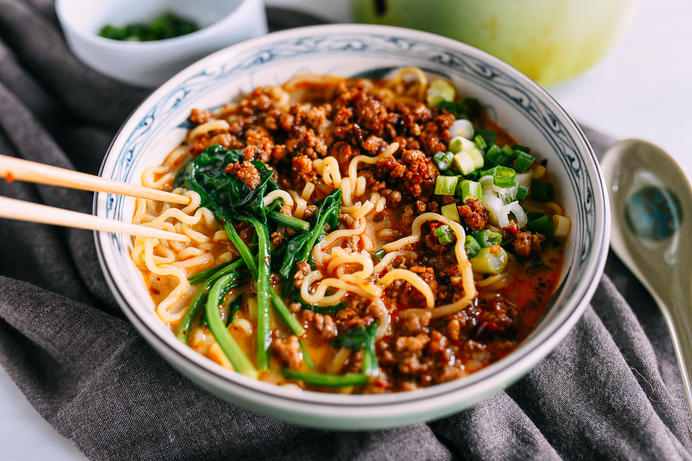

||| :icon-clock: Time
45 mins
||| :knife: Prep
30 mins
||| :cook: Cooking
15 min
||| :hash: Servings
2
|||

=== Ingredients

###### Pork Topping
- 8 ounces ground pork
- 1 tablespoon mirin
- 1 tablespoon ginger (minced)
- 1 tablespoon vegetable oil
- 1 tablespoon spicy bean sauce (Sichuan doubanjiang)
- 2 cloves garlic (minced)
###### Soup Base
- 2 tablespoons soy sauce
- 2 tablespoons roasted sesame paste
- 1 teaspoon rice vinegar
- 1/2 teaspoon sugar
- 1 tablespoon Chili Oil
- 2 cups chicken stock
- 2 cups unsweetened oat milk
###### Noodles and Toppings
- 2 handfuls leafy greens
- 10-12 ounces fresh or frozen ramen noodles
- 2 scallions (chopped)

===

=== Steps

1. Combine the ground pork with the mirin and minced ginger. Set aside for 15 minutes to marinate.
Meanwhile, in a medium bowl, make the tare for the soup base. Whisk together the soy sauce, sesame paste, rice vinegar, sugar, and chili oil until smooth. Set aside.
 
 

2. Combine the chicken stock and oat milk in a pot, and bring to a simmer. Cover to keep warm. (Do not let this mixture go above a low simmer. If it boils, the milk may split, causing it to curdle.) Also bring a large pot of water to a boil for the leafy greens and the noodles.
 
 

3. Heat a wok over medium high heat until it begins to smoke. Add 1 tablespoon of oil and the pork. Brown the pork until the bits of ground meat are crispy. Add the spicy bean sauce and minced garlic, and cook for another minute. Turn off the heat and set aside.
 
 

4. To the pot of boiling water, add the green vegetables and blanch for 30 seconds to 1 minute. Remove from the water, drain, and set aside. Bring the water to a rolling boil again, and add the noodles, cooking them according to package directions until they’re just cooked through and still chewy.
 
 

5. Add half of the sesame paste mixture to each bowl, followed by the hot simmering stock/milk mixture. Stir to combine. Divide the cooked noodles between the two bowls, and top with the cooked pork, blanched veggies, and chopped scallions. If you like yours extra spicy, you can add a bit more chili oil on top.

===
