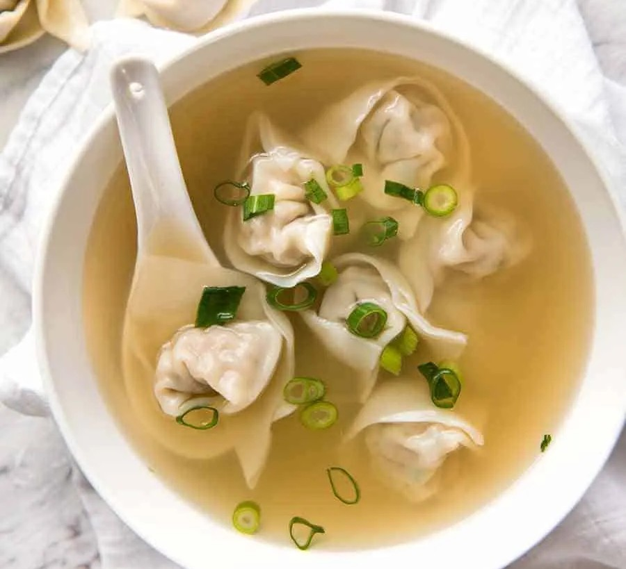

||| :icon-clock: Time
35 mins
||| :knife: Prep
20 mins
||| :cook: Cooking
15 min
||| :hash: Servings
2
|||

=== Ingredients

- 3 cups / 750 ml chicken broth
- 200g thin wonton noodles
- 8-12 wontons depending on size
- 2 garlic cloves , smashed
- ⅓” / 1 cm piece of ginger , sliced 
- 1½ tbsp light soy sauce 
- 2 tsp sugar
- 1½ tbsp chinese cooking wine
- sesame oil to taste

===

=== Steps

1. Add the incredients to a pot and bring to a simmer
 
 

4. Cook the noodles and wontons in a separate pot. Adjust the timing of when you add each depending on if either ingredient is fresh or not. 
 
 

5. Add the wontons and noodles to the broth and serve.
===
